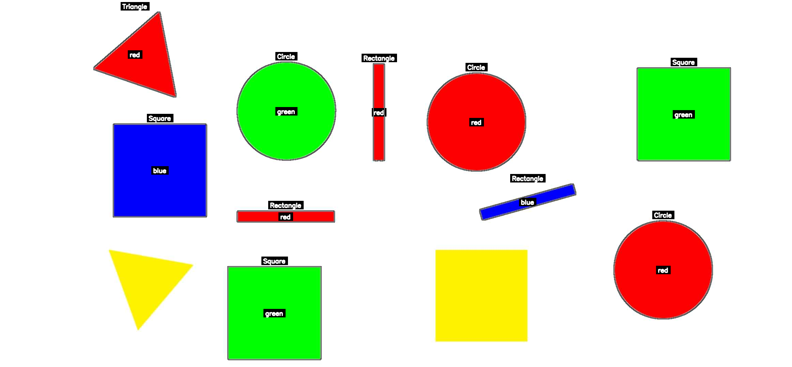

# Task 11.3 — Shape and Color Detection (Classical Approach)

## 1. How the task was approached

This solution uses **classical computer vision methods** with OpenCV, not deep learning.  
The idea is to first detect shapes using contour analysis, then detect colors using HSV ranges.  
The result is an annotated image where each shape is labeled with its geometry and color.  

---

## 2. Algorithms and techniques

### Preprocessing  
- Convert the image to grayscale.  
- Apply Gaussian blur to reduce noise.  
- Use Canny edge detection to find edges.  
- Apply dilation to close gaps and strengthen edges.  

### Shape detection  
- Find contours with `cv2.findContours`.  
- Approximate contour polygons with `cv2.approxPolyDP`.  
- Classification logic:  
  - **3 vertices** → Triangle  
  - **4 vertices** → Square if side ratio ~1, else Rectangle  
  - **>4 vertices** and circularity > 0.7 → Circle  

### Color detection  
- Convert the image to HSV color space.  
- Define HSV ranges for black, white, red, green, blue, yellow, etc.  
- For each contour, apply the mask and measure how many pixels fall into each range.  
- Pick the color with the highest response above a threshold.  
- Red is treated as a special case (two separate ranges combined).  

### Annotation  
- Each shape is annotated with:  
  - Shape name above the bounding box.  
  - Color name inside the shape center.  
- Black background rectangles are drawn behind text for readability.  

---

## 3. Challenges and insights

- **Yellow detection**: HSV ranges for yellow required fine tuning. We used lower saturation/value thresholds and adaptive thresholds for color area.  
- **Noise handling**: Very small contours (<100 pixels) are ignored.  
- **Classical vs deep learning**: With no CNN or YOLO, the solution relies heavily on heuristics (vertex count, side ratios, circularity). This works well in clean images but can fail in noisy or complex scenes.  
- **Insight**: Classical methods are efficient and explainable, but not robust to varied lighting and complex shapes compared to deep learning.  

---

## 4. Results

Running:  
```bash
python shapes.py test.jpg
```

Produces an output image like this:  



Shapes are outlined, the shape type is written above, and the color is written inside the shape.  
